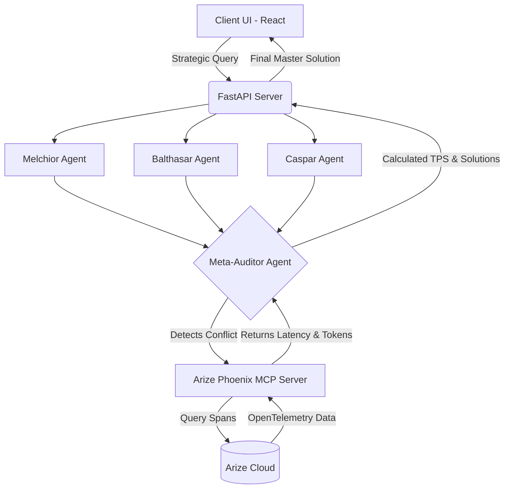

# MAGI System: Multi-Agent Decision Maker


## Overview
The MAGI System is an AI-powered decision-making engine designed to evaluate complex problems from multiple perspectives. When faced with a difficult strategic or ethical dilemma, three distinct AI personas: Melchior (Data), Balthasar (Empathy), and Caspar (Speed), generate independent recommendations. 

If the agents disagree, a Meta-Auditor agent steps in. Instead of just guessing who is right, the Auditor uses the Phoenix Model Context Protocol (MCP) by Arize to pull real-time execution data. By analyzing the **Processing Density (Tokens Per Second)** of each agent, the system mathematically determines which agent had the highest confidence and synthesizes a final, balanced decision backed by hard data.

### Inspiration
This project is inspired by the fictional MAGI supercomputer from the anime ***Neon Genesis Evangelion***. Just like the anime, this system relies on the consensus of three distinct personality matrices: **Melchior (the logical scientist), Balthasar (the empathetic mother), and Caspar (the pragmatic woman)**, to evaluate complex dilemmas before executing a final decision.

## System Architecture



### How the Flow Works

1. **The Input:** The user provides the background context of a problem and asks a specific decision-based query.
2. **The Evaluation:** The FastAPI backend concurrently fires the query to three different Gemini-powered agents, each restricted to a specific persona and viewpoint.
3. **The Conflict:** If the agents return mixed opinions or completely clash, the Meta-Auditor is triggered.
4. **The Audit:** The Auditor pauses text generation and uses MCP to query Arize Phoenix for the exact OpenTelemetry traces of the three agents' thought processes.
5. **The Metric (TPS):** Standard telemetry doesn't capture token probability. Instead, the system calculates Processing Density (Tokens Per Second) by comparing the completion tokens against the total ISO timestamp latency. A higher TPS indicates that the LLM generated the response easily and confidently, without "server hesitation."
6. **The Resolution:** The Auditor trusts the logic of the agent with the highest TPS, using it as the foundation to synthesize a final master solution.

## Repository Structure

```text
magi-system/
├── backend/
│   ├── agents/
│   │   ├── auditor.py
│   │   ├── balthasar.py
│   │   ├── caspar.py
│   │   └── melchior.py
│   ├── .env
│   ├── main.py
│   ├── models.py
│   ├── orchestrator.py
│   ├── test.py
│   └── tracing.py
├── demo/
├── frontend/
│   └── (React/Vite frontend files)
├── venv/
├── .gitignore
├── Dockerfile
├── LICENSE
├── README.md
└── requirements.txt

```

## Core Features

* **Concurrent Multi-Agent Generation:** Fires three distinct AI personas simultaneously to evaluate a single query from different perspectives.
* **Live Telemetry Auditing:** Integrates the `@arizeai/phoenix-mcp` server to fetch OpenTelemetry spans dynamically during runtime.
* **Mathematical Conflict Resolution:** Calculates Processing Density (TPS) to break logical ties instead of relying on pure text evaluation.
* **Cognitive Circuit Breakers:** Implements strict Python-level boundary controls to prevent LLM infinite looping when parsing dense JSON telemetry arrays.

## Technology Stack

* **AI & Orchestration:** Gemini 3.1 Flash Lite (via `google-genai` SDK)
* **Observability & Telemetry:** Arize Phoenix, OpenTelemetry, Model Context Protocol (MCP)
* **Backend:** Python, FastAPI, Pydantic
* **Frontend:** React, Vite, TailwindCSS

## Local Installation & Setup

### Prerequisites

* Python 3.13+
* Node.js 20+
* An Arize Phoenix account and API Key
* A Google Gemini API Key

### Backend Setup

1. Clone the repository.
2. Create and activate a virtual environment in the root directory:

```bash
python -m venv venv
source venv/bin/activate  # On Windows: source venv/Scripts/activate

```

3. Install dependencies from the root directory:

```bash
pip install -r requirements.txt

```

4. Create a `.env` file inside the `backend/` directory:

```env
GEMINI_API_KEY=your_gemini_key
PHOENIX_API_KEY=your_arize_key
PHOENIX_COLLECTOR_ENDPOINT="https://app.phoenix.arize.com/s/your-endpoint"
```

5. Navigate to the backend and start the FastAPI server:

```bash
cd backend
uvicorn main:app --reload --port 8000

```

### Frontend Setup

1. Navigate to the frontend directory.
2. Install dependencies:

```bash
npm install

```

3. Create a `.env` file in the frontend root:

```env
VITE_API_URL=http://127.0.0.1:8000

```

4. Start the development server:

```bash
npm run dev

```

## Testing (`test.py`)

To verify the system's conflict-resolution logic, a built-in stress tester is included in the backend. `test.py` runs the pipeline against specific edge cases (e.g., Unanimous Crises, Ethical Dilemmas) to ensure the circuit breakers and TPS calculations hold up under varying levels of agent disagreement.

To run the tests (ensure your FastAPI server is running first):

```bash
cd backend
python test.py

```

## License

This project is licensed under the MIT License. See the LICENSE file for details.